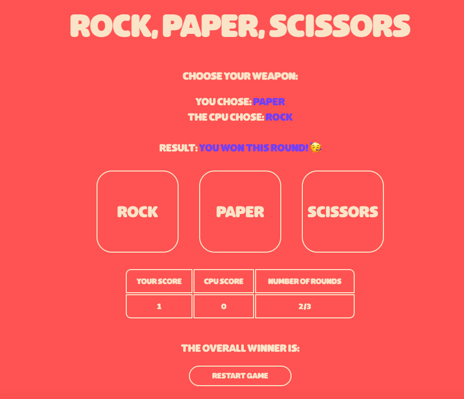

# Rock, Paper, Scissors Game

This project is a simple implementation of the classic game "Rock, Paper, Scissors" using React. The webpage allows users to play against the computer for three rounds, tracking scores and determining the overall winner.

## Features

- **User Interaction**: The user can select Rock, Paper, or Scissors by clicking on one of the buttons.
- **CPU Interaction**: The computer randomly selects Rock, Paper, or Scissors for each round.
- **Round Result**: Displays the result of each round, indicating who won or if it was a tie.
- **Score Tracking**: Keeps track of both the user's and the CPU's scores.
- **Overall Winner**: Declares the overall winner after three rounds and prompts the user for the next round.
- **Game Restart**: Allows the game to be restarted at any time.

## How the Webpage Works

1. **User Chooses a Move**:

   - The user clicks on Rock, Paper, or Scissors.
   - The user's choice is recorded and displayed.

2. **CPU Chooses a Move**:

   - The CPU randomly selects Rock, Paper, or Scissors.
   - The CPU's choice is displayed.

3. **Determine the Winner of the Round**:

   - The game compares the user's choice with the CPU's choice.
   - The result of the round is displayed:
     - If the user wins, the user's score is incremented.
     - If the CPU wins, the CPU's score is incremented.
     - If it's a tie, no scores are incremented.

4. **Track Rounds**:

   - The game keeps track of the number of rounds played.
   - After three rounds, the game checks and displays the overall winner based on the scores.

5. **Restart the Game**:
   - The user can restart the game at any time by clicking the "Restart Game" button, which resets all scores and rounds.

## Screenshot

## Link to Live Demo

[Rock, Paper, Scissors Game Live Demo](https://rockpaperscissorsshakedown.netlify.app)

This webpage provides an engaging way to play Rock, Paper, Scissors, offering a fun and interactive experience while demonstrating basic game logic and state management in a React application.
